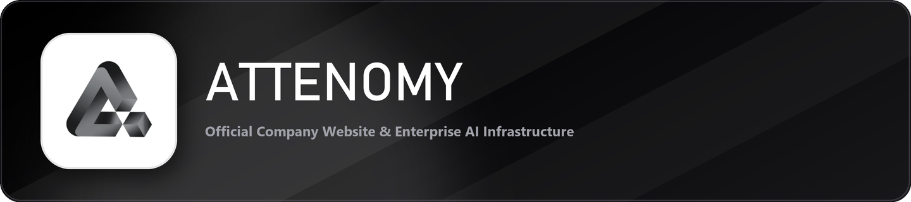

# Attenomy — Official Company Website

<div align="center">
  
</div>

<br />

<div align="center">
  <a href="https://github.com/attenomy/website">
    
  </a>
  <a href="https://attenomy.com">
    
  </a>
  <a href="https://people.attenomy.com">
    
  </a>
  
</div>

<br />

---

## 🏢 Executive Overview

Welcome to the official web repository for **Attenomy** maintained under **[attenomy/website](https://github.com/attenomy/website)**. 

Attenomy builds next-generation AI agents, enterprise automation software, and digital infrastructure solutions. This repository powers our primary flagship website (`attenomy.com`) alongside our enterprise talent & HR ecosystem (`people.attenomy.com`).

---

## 🌟 Key Features & Highlights

- **AI-Native Product Showcase**: Interactive UI presenting Attenomy's core AI platforms, client solutions, and research initiatives.
- **Unified Branding & Design System**: Crafted with custom glassmorphism, responsive light/dark themes, and high-performance micro-interactions.
- **Integrated Ecosystem**: Seamlessly linked with [Attenomy People](https://people.attenomy.com) for career openings, verified credentials, and applicant tracking.
- **Ultra-Fast Performance**: Built on Next.js App Router, React Server Components, and optimized vector graphics.

---

## 🛠️ Technology Stack

| Layer | Technology |
| :--- | :--- |
| **Framework** | [Next.js](https://nextjs.org/) (App Router & React) |
| **Language** | [TypeScript](https://www.typescriptlang.org/) |
| **Styling** | [Tailwind CSS](https://tailwindcss.com/) & Custom Utility Design Tokens |
| **Animations & Effects** | [Framer Motion](https://www.framer.com/motion/) & [React Bits](https://reactbits.dev/) |
| **Icons** | [Lucide React](https://lucide.dev/) |
| **Repository** | [`attenomy/website`](https://github.com/attenomy/website) |

---

## 📊 Repository Metrics

<div align="center">
  
[](https://github.com/attenomy/website)
[](https://github.com/attenomy/website)
[](https://github.com/attenomy/website/issues)
[](https://github.com/attenomy/website/blob/main/LICENSE)

</div>

---

## 🚀 Quick Start Guide

### Prerequisites
- Node.js `>= 18.17.0`
- `npm` or `yarn`

### Local Development

1. **Clone the Repository**:
   ```bash
   git clone https://github.com/attenomy/website.git
   cd website/attenomy-website
   ```

2. **Install Dependencies**:
   ```bash
   npm install
   ```

3. **Start Development Server**:
   ```bash
   npm run dev
   ```
   Access the application at **[http://localhost:3000](http://localhost:3000)**.

4. **Production Build**:
   ```bash
   npm run build
   npm run start
   ```

---

## 🌐 Attenomy Digital Network

- **Flagship Website**: [attenomy.com](https://attenomy.com)
- **People & Talent Portal**: [people.attenomy.com](https://people.attenomy.com)
- **GitHub Repository**: [github.com/attenomy/website](https://github.com/attenomy/website)

---

<div align="center">
  <sub>© 2026 Attenomy. All rights reserved. Official source repository <code>attenomy/website</code>.</sub>
</div>
